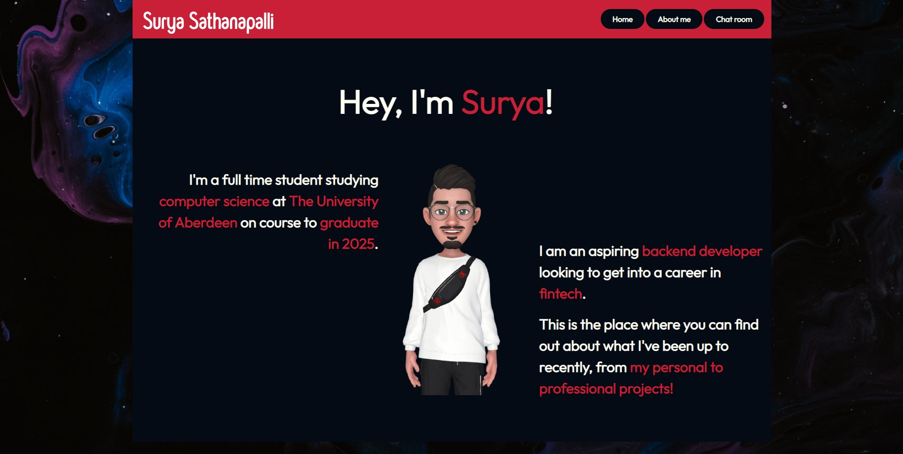

# Personal Portfolio Assignment

Welcome to my personal portfolio project! This project showcases my skills, projects, and experience as a developer. Built with a combination of HTML, CSS, and JavaScript, it's designed to be responsive and user-friendly on both desktop and mobile devices. Feel free to check it out, provide feedback, or use it as inspiration for your own portfolio.

## Table of Contents

- [Features](#features)
- [Getting Started](#getting-started)
- [Prerequisites](#prerequisites)
- [Installation](#installation)
- [Usage](#usage)
- [Contributing](#contributing)
- [License](#license)
- [Contact](#contact)

## Features

- Responsive design for both desktop and mobile devices
- Eye-catching animations and transitions
- Interactive project showcase with live demos and source code links
- Skill and experience section to highlight my expertise
- Contact form for easy communication
- Footer with social media links

## Getting Started

To get a local copy up and running, follow these simple steps:

### Prerequisites

- [Node.js](https://nodejs.org/en/) (v14.0.0 or higher)
- [npm](https://www.npmjs.com/) (v7.0.0 or higher)

### Installation

1. Clone the repository:

